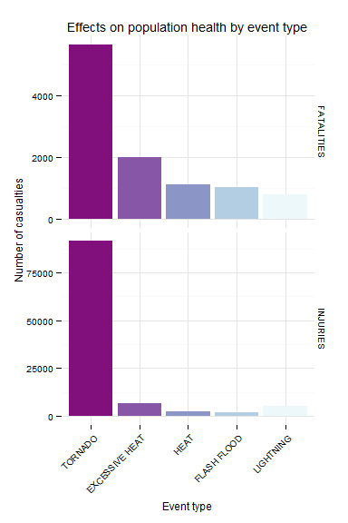
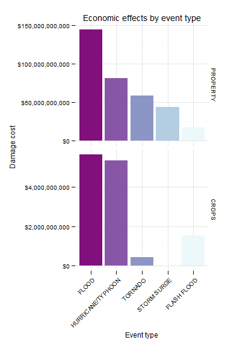

# Identifying public health and economic effects caused by severe weather events
Hugo Janssen  
15 Jun 2015  


## Introduction

This project is part of the course Reproducible Research. It explores the U.S. National Oceanic and Atmospheric Administration's (NOAA) storm database.

> Storms and other severe weather events can cause both public health and economic problems for communities and municipalities. Many severe events can result in fatalities, injuries, and property damage, and preventing such outcomes to the extent possible is a key concern.

> This project involves exploring the U.S. National Oceanic and Atmospheric Administration's (NOAA) storm database. This database tracks characteristics of major storms and weather events in the United States, including when and where they occur, as well as estimates of any fatalities, injuries, and property damage.

The data analysis in this document addresses the following questions:

1. Which types of events are most harmful with respect to population health?
2. Which types of events have the greatest economic consequences? 


## Data Processing

In this section, the data is downloaded and cleaned. Load package dependencies first.


```r
library(reshape2)
library(ggplot2) 
library(RColorBrewer) 
library(scales)
```


### Download the dataset

The data for this assignment is obtained from the [course web site](https://d396qusza40orc.cloudfront.net/repdata%2Fdata%2FStormData.csv.bz2). The zipped data file is saved to the `data` directory and read into a data object.


```r
# Check if data directory exists, create one if needed
if (!file.exists("data")) {
    dir.create("data")
}

# Download the dataset
if (!file.exists("./data/dataset.bz2")) {
    fileURL <- "https://d396qusza40orc.cloudfront.net/repdata%2Fdata%2FStormData.csv.bz2"
    download.file(fileURL, destfile="./data/dataset.bz2")
}

# Read the data
data <- read.csv("./data/dataset.bz2")
```


### Load the data

To minimize the amount of data, only the columns that hold relevant information regarding the questions above will be used for further analysis. A quick inspection of the column headers shows the following:


```r
names(data)
```

```
##  [1] "STATE__"    "BGN_DATE"   "BGN_TIME"   "TIME_ZONE"  "COUNTY"    
##  [6] "COUNTYNAME" "STATE"      "EVTYPE"     "BGN_RANGE"  "BGN_AZI"   
## [11] "BGN_LOCATI" "END_DATE"   "END_TIME"   "COUNTY_END" "COUNTYENDN"
## [16] "END_RANGE"  "END_AZI"    "END_LOCATI" "LENGTH"     "WIDTH"     
## [21] "F"          "MAG"        "FATALITIES" "INJURIES"   "PROPDMG"   
## [26] "PROPDMGEXP" "CROPDMG"    "CROPDMGEXP" "WFO"        "STATEOFFIC"
## [31] "ZONENAMES"  "LATITUDE"   "LONGITUDE"  "LATITUDE_E" "LONGITUDE_"
## [36] "REMARKS"    "REFNUM"
```

Since the research questions focus on public health and economic consequences, the following columns are selected and loaded into a data frame.


```r
colnames <- c("EVTYPE", "FATALITIES", "INJURIES", "PROPDMG", "PROPDMGEXP", "CROPDMG", "CROPDMGEXP")
d <- data.frame(data[, colnames])
```


### Clean data

#### Event types

A first look at the event types shows <b>985 different event types</b>, whereas the [documentation](https://d396qusza40orc.cloudfront.net/repdata%2Fpeer2_doc%2Fpd01016005curr.pdf) (Table 1, page 6) defines only <b>48 types</b>. This means that the data set is not very tidy, due to differences in notation or misspelling. In order the make the data set more consistent, the event types that are most meaningful to the research questions are redefined. 


```r
# All types to upper case
d$EVTYPE <- toupper(d$EVTYPE)

# Replace misspelled types
d[which(d$EVTYPE=="COLD AND SNOW"), "EVTYPE"] <- "COLD/WIND CHILL"

d[which(d$EVTYPE=="FOG"), "EVTYPE"] <- "DENSE FOG"

d[which(d$EVTYPE=="EXTREME COLD"), "EVTYPE"] <- "EXTREME COLD/WIND CHILL"

d[which(d$EVTYPE=="EXTREME HEAT" |
        d$EVTYPE=="RECORD/EXCESSIVE HEAT" ), "EVTYPE"] <- "EXCESSIVE HEAT"

d[which(d$EVTYPE=="FLASH FLOOD/FLOOD" |
        d$EVTYPE=="FLASH FLOODING" | 
        d$EVTYPE=="FLASH FLOODING/FLOOD" |
        d$EVTYPE=="FLOOD/FLASH FLOOD" |
        d$EVTYPE=="FLASH FLOODS"), "EVTYPE"] <- "FLASH FLOOD"

d[which(d$EVTYPE=="FLOOD & HEAVY RAIN" |
        d$EVTYPE=="FLOOD/RIVER FLOOD" |
        d$EVTYPE=="FLOODING"), "EVTYPE"] <- "FLOOD"

d[which(d$EVTYPE=="HEAT WAVE" |
        d$EVTYPE=="HEAT WAVES"|
        d$EVTYPE=="UNSEASONABLY WARM AND DRY"), "EVTYPE"] <- "HEAT"

d[which(d$EVTYPE=="HURRICANE"), "EVTYPE"] <- "HURRICANE/TYPHOON"

d[which(d$EVTYPE=="THUNDERSTORM WIND (G40)" |
        d$EVTYPE=="THUNDERSTORM WIND G52" |
        d$EVTYPE=="THUNDERSTORM WINDS" |
        d$EVTYPE=="THUNDERTORM WINDS" |
        d$EVTYPE=="TSTM WIND" |
        d$EVTYPE=="TSTM WIND (G35)" |
        d$EVTYPE=="TSTM WIND/HAIL"), "EVTYPE"] <- "THUNDERSTORM WIND"

d[which(d$EVTYPE=="TORNADOES, TSTM WIND, HAIL"), "EVTYPE"] <- "TORNADO"

d[which(d$EVTYPE=="WILD FIRES"), "EVTYPE"] <- "WILDFIRE"
```


#### Damage cost

The storm data [documentation](https://d396qusza40orc.cloudfront.net/repdata%2Fpeer2_doc%2Fpd01016005curr.pdf) (Page 12) describes that

> Estimates should be rounded to three significant digits, followed by an alphabetical character signifying the magnitude of the number, i.e., 1.55B for $1,550,000,000. Alphabetical characters used to signify magnitude include "K" for thousands, "M" for millions, and "B" for billions. 

When looking at the damage data, one can see that there are 2 columns describing damage data `CROPDMG` and `CROPDMGEXP`. The values in both columns can be translated into one value by following the approach as described in [this article](https://rstudio-pubs-static.s3.amazonaws.com/58957_37b6723ee52b455990e149edde45e5b6.html).


```r
# Transform exponent to a numeric value
d$CROPDMGEXP <- as.character(d$CROPDMGEXP)
d$CROPDMGEXP[d$CROPDMGEXP %in% c("b","B")] <- "1000000000"
d$CROPDMGEXP[d$CROPDMGEXP %in% c("m","M")] <- "1000000"
d$CROPDMGEXP[d$CROPDMGEXP %in% c("k","K")] <- "1000"
d$CROPDMGEXP[d$CROPDMGEXP %in% c("h","H")] <- "100"
d$CROPDMGEXP[d$CROPDMGEXP %in% c("0","1","2","3","4","5","6","7","8","9")] <- "10"
d$CROPDMGEXP[d$CROPDMGEXP %in% c("+")] <- "1"
d$CROPDMGEXP[d$CROPDMGEXP %in% c("","?","-")] <- "0"
d$CROPDMGEXP <- as.numeric(d$CROPDMGEXP)

# Compute new value for crop damage
d$CROPDMG <- d$CROPDMG * d$CROPDMGEXP


# Transform exponent to a numeric value
d$PROPDMGEXP <- as.character(d$PROPDMGEXP)
d$PROPDMGEXP[d$PROPDMGEXP %in% c("b","B")] <- "1000000000"
d$PROPDMGEXP[d$PROPDMGEXP %in% c("m","M")] <- "1000000"
d$PROPDMGEXP[d$PROPDMGEXP %in% c("k","K")] <- "1000"
d$PROPDMGEXP[d$PROPDMGEXP %in% c("h","H")] <- "100"
d$PROPDMGEXP[d$PROPDMGEXP %in% c("0","1","2","3","4","5","6","7","8","9")] <- "10"
d$PROPDMGEXP[d$PROPDMGEXP %in% c("+")] <- "1"
d$PROPDMGEXP[d$PROPDMGEXP %in% c("","?","-")] <- "0"
d$PROPDMGEXP <- as.numeric(d$PROPDMGEXP)

# Compute new value for property damage
d$PROPDMG <- d$PROPDMG * d$PROPDMGEXP
```


## Visualization

### Effects on population health by event type

The effects on population health are visualized as a chart where event types are plotted against the number of casualties that they have caused in terms of fatalities and injuries.


```r
# Melt population health data
mph <- melt(d, id.vars = "EVTYPE", measure.vars = c("FATALITIES", "INJURIES"), na.rm = TRUE)

# Cast aggregate data 
cph <- dcast(mph, EVTYPE ~ variable, sum)

# Select the top 5 events with most impact
events <- unique(c(cph[order(-cph$FATALITIES)[1:5], "EVTYPE"]), cph[order(-cph$INJURIES)[1:5], "EVTYPE"])

# Define factors to make the plot sort nicely
mph$EVTYPE <- factor(mph$EVTYPE, levels=events)

# Define the plot
ph <- ggplot(mph[mph$EVTYPE %in% events, ], aes(EVTYPE, value))

# Add layers
ph + geom_bar(stat = "identity", aes(fill = EVTYPE)) + 
    facet_grid(variable ~ ., scales = "free") + 
    labs(title = "Effects on population health by event type") + 
    labs(x = "Event type") + 
    labs(y = "Number of casualties") + 
    theme_minimal(base_family = "", base_size = 9) + 
    theme(legend.position = "none", axis.text.x = element_text(angle = 45, hjust = 1)) + 
    scale_fill_manual(values = rev(brewer.pal(5, "BuPu")))
```




### Economic effects by event type

The economic effects are visualized as a chart where event types are plotted against the amount of damage that they have caused to crops and property (in US$).


```r
# Melt economic damage data
mec <- melt(d, id.vars = "EVTYPE", measure.vars = c("PROPDMG", "CROPDMG"), na.rm = TRUE)

# Cast aggregate data 
cec <- dcast(mec, EVTYPE ~ variable, sum)

# Select the top 5 events with most impact
events <- unique(c(cec[order(-cec$PROPDMG)[1:5], "EVTYPE"]), cec[order(-cec$CROPDMG)[1:5], "EVTYPE"])

# Define factors to make the plot sort nicely
mec$EVTYPE <- factor(mec$EVTYPE, levels=events)

# Define the plot
pe <- ggplot(mec[mec$EVTYPE %in% events, ], aes(EVTYPE, value))

# Prepare vector for labelling panels
labels <- c("PROPDMG" = "PROPERTY", "CROPDMG" = "CROPS")

# Add layers
pe + geom_bar(stat = "identity", aes(fill = EVTYPE)) + 
    facet_grid(variable ~ ., scales = "free", labeller = labeller(variable = labels)) + 
    labs(title = "Economic effects by event type") + 
    labs(x = "Event type") + 
    labs(y = "Damage cost") + 
    theme_minimal(base_family = "", base_size = 9) + 
    theme(legend.position = "none", axis.text.x = element_text(angle = 45, hjust = 1)) + 
    scale_fill_manual(values = rev(brewer.pal(5, "BuPu"))) +
    scale_y_continuous(labels = dollar)
```




## Results

The figures above clearly show that a <b>tornado</b> is most devastating for the human population, yielding far more casualties than runners-up excessive heat, heat, flash floods and lightning. <b>Floods</b> have most impact in terms of economic damage, followed by hurricanes/typhoons, tornadoes, storm surges and flash floods. 


## References

The following sources were used in this analysis:

* [Storm Data](https://d396qusza40orc.cloudfront.net/repdata%2Fdata%2FStormData.csv.bz2)

* National Weather Service Storm Data [Documentation](https://d396qusza40orc.cloudfront.net/repdata%2Fpeer2_doc%2Fpd01016005curr.pdf)

* National Climatic Data Center Storm Events [FAQ](https://d396qusza40orc.cloudfront.net/repdata%2Fpeer2_doc%2FNCDC%20Storm%20Events-FAQ%20Page.pdf)

* [How To Handle Exponent Value of PROPDMGEXP and CROPDMGEXP](https://rstudio-pubs-static.s3.amazonaws.com/58957_37b6723ee52b455990e149edde45e5b6.html)

* Data Visualization with ggplot2 [Cheat Sheet](http://www.rstudio.com/wp-content/uploads/2015/03/ggplot2-cheatsheet.pdf)

